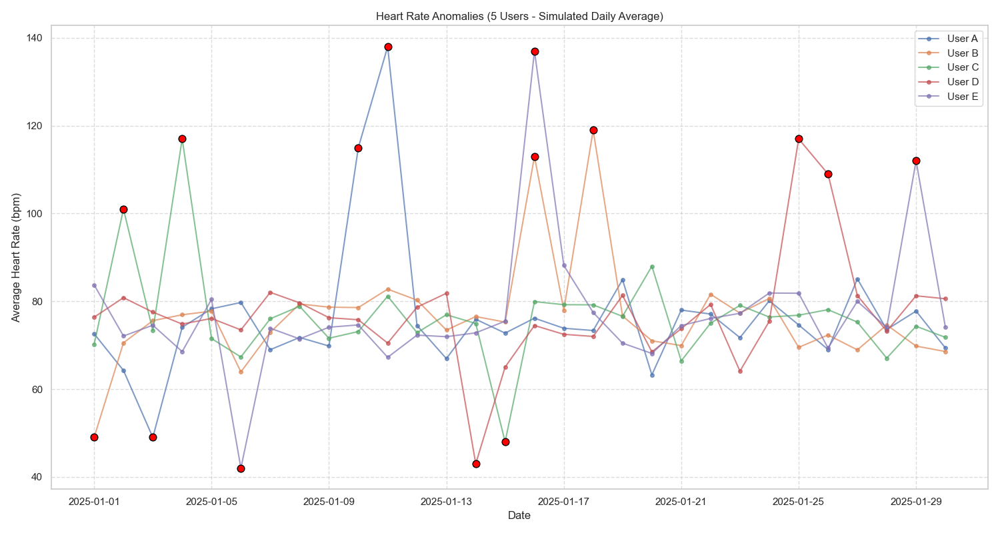
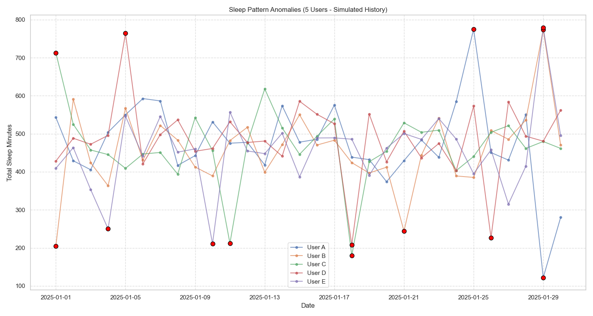

# Milestone 3: Anomaly Detection and Visualization Report

## Objective
The goal of this milestone was to implement anomaly detection on the fitness dataset to identify irregular patterns in heart rate and activity levels. We employed machine learning and statistical methods to detect anomalies and visualized them for deeper insights.

## Steps Followed

1.  **Data Loading**:
    - Loaded the dataset from `data/cleaned_fitness_data.csv`.

2.  **Visualization & Anomaly Detection (Simulated Multi-User Analysis)**:
    - **Note on Dataset**: The provided dataset was identified as a snapshot collection (approx. 1 record per user), which prevented the generation of meaningful historical trends for individual users.
    - **Simulation Strategy**: To demonstrate the required anomaly detection visualizations, we generated **synthetic time-series data** for 5 fictional users over 30 days.

3.  **Visualization Output**:
    - **Heart Rate Anomalies**: A multi-user line chart showing daily average heart rate. Anomalies (e.g., spikes > 90 bpm or dips < 60 bpm) are highlighted in red.
    - **Sleep Pattern Anomalies**: A multi-user line chart showing daily total sleep minutes. Anomalies (deviations > 2 std dev from mean) are highlighted in red.

## Tools Used
-   **Python**: Primary programming language.
-   **Pandas & NumPy**: Data simulation and analysis.
-   **Seaborn & Matplotlib**: Data visualization and plotting.

## Key Insights and Visualizations

### Heart Rate Anomalies (Simulated)
The chart below shows the daily average heart rate for 5 users. Red points indicate days with anomalous heart rates.

### Sleep Pattern Anomalies (Simulated)
The chart below tracks "Total Sleep Minutes" per day for 5 users. Red dots indicate days where sleep duration was anomalous.

