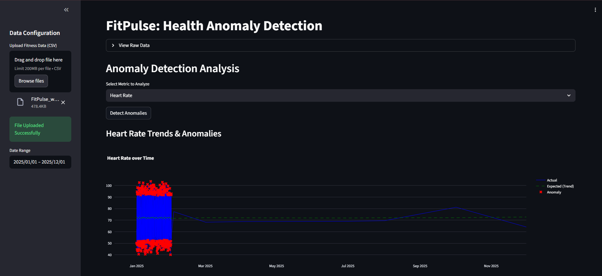
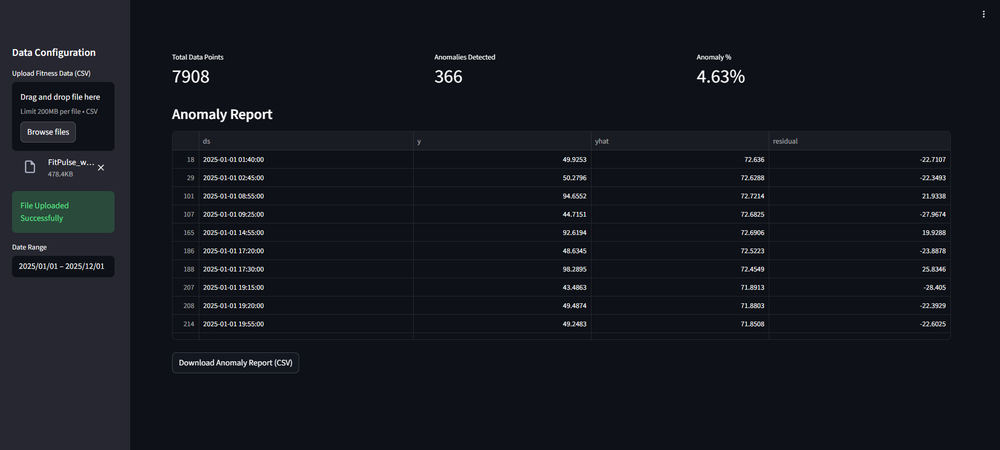

# Milestone 4: Dashboard Report Summary

## Objective
The primary objective of this milestone is to develop an interactive and user-friendly dashboard for the FitPulse Health Anomaly Detection system. This dashboard serves as the interface for users to upload their fitness data, visualize health metrics, identify anomalies (such as irregular heart rates), and generate actionable insights without needing technical expertise.

## Dashboard Workflow
The dashboard follows a streamlined workflow to process and present data:
1.  **Data Upload**: The user uploads a fitness dataset (CSV format) via the specific "Data Configuration" sidebar panel.
2.  **Data Preprocessing**: The system automatically cleans the data, handling missing values and ensuring consistent formatting (e.g., timestamp alignment).
3.  **Analysis & Detection**: Backend algorithms analyze the data to detect anomalies using statistical thresholds or machine learning models.
4.  **Visualization**: The dashboard renders interactive charts, such as Heart Rate over Time, with anomalies clearly marked in red.
5.  **Reporting**: A detailed table lists all detected anomalies with timestamps and values. Users can download this report as a CSV file.

## Tools & Libraries Used
The following technologies were instrumental in building the dashboard:
-   **Streamlit**: For creating the web-based user interface.
-   **Pandas**: For efficient data manipulation and time-series processing.
-   **Plotly/Altair**: For generating interactive and dynamic charts.
-   **Scikit-learn/Statsmodels**: For implementing anomaly detection algorithms (e.g., Isolation Forest, Z-score).
-   **Python**: The core programming language for the backend logic.

## Key Insights from the Dashboard
-   **Anomaly Visualization**: The dashboard successfully highlights outlier data points in heart rate trends, allowing for quick visual identification of potential health issues.
-   **Trend Analysis**: Users can observe long-term trends in their health metrics, distinguishing between normal fluctuations and significant deviations.
-   **Data Quality**: The preprocessing step ensures that only valid data is analyzed, preventing noise from skewing the results.

## Screenshot References

### Dashboard UI
The main interface showing the uploaded data status and the interactive anomaly detection analysis graph.

### Report & Download
The detailed anomaly report table and the feature to download the findings.

